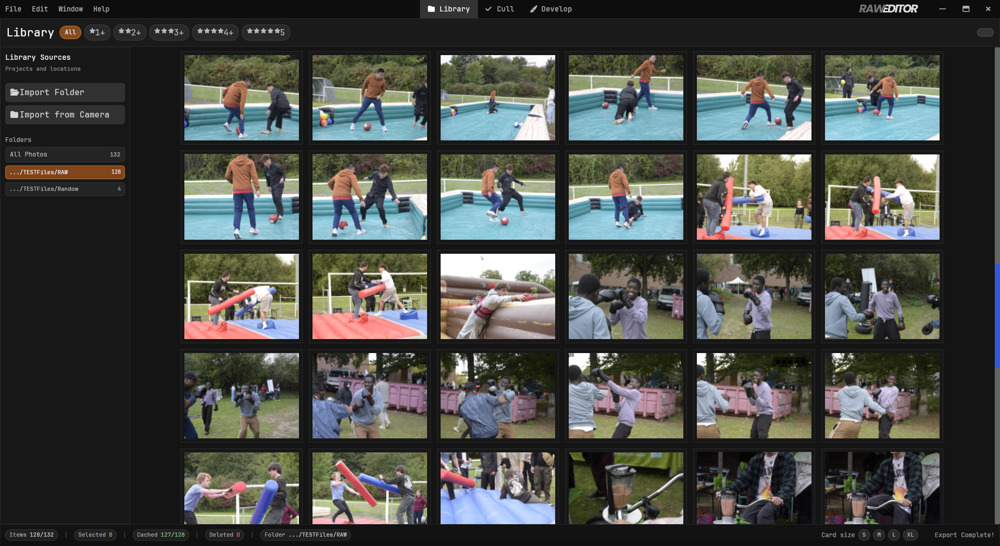
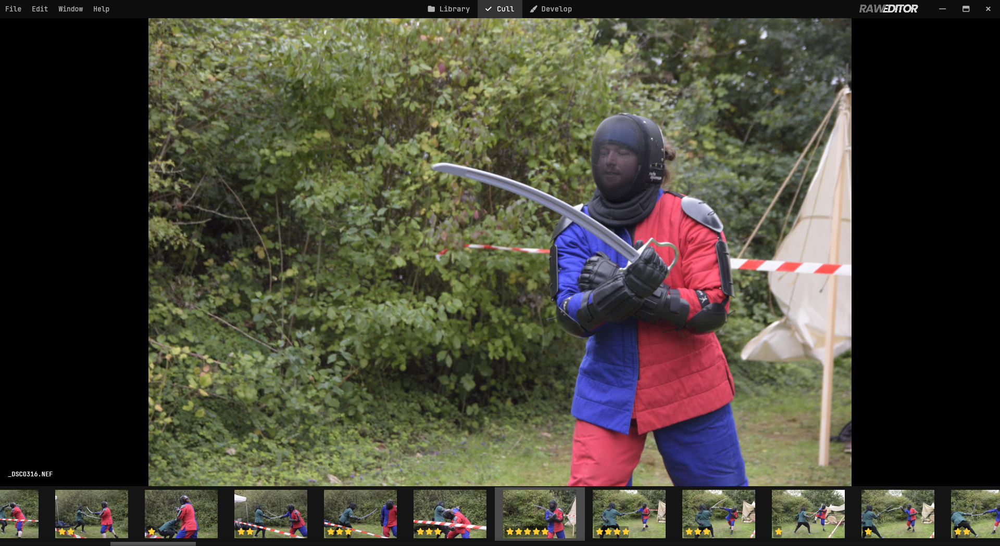
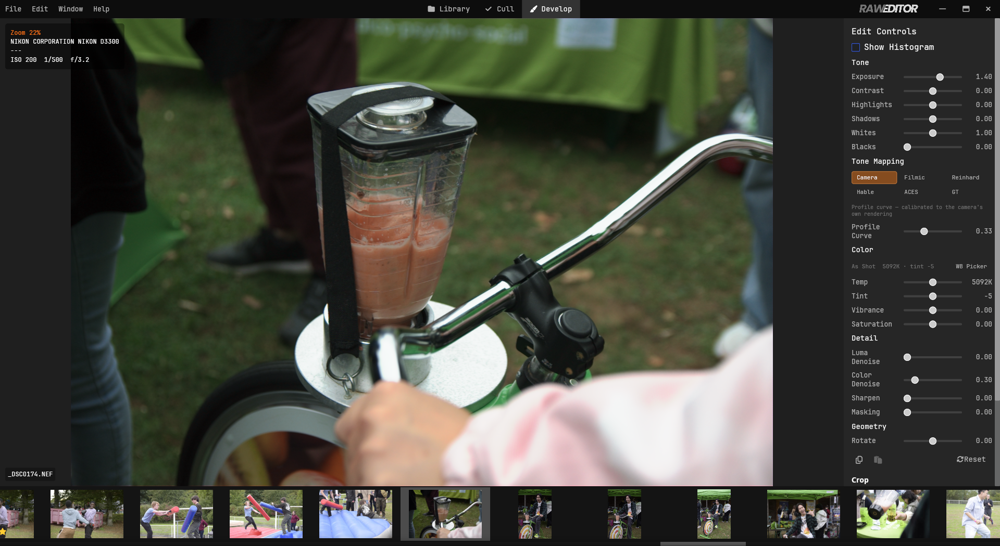
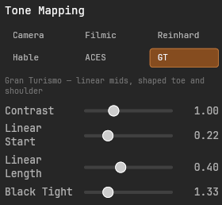
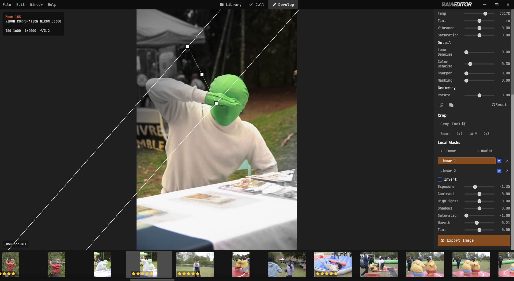
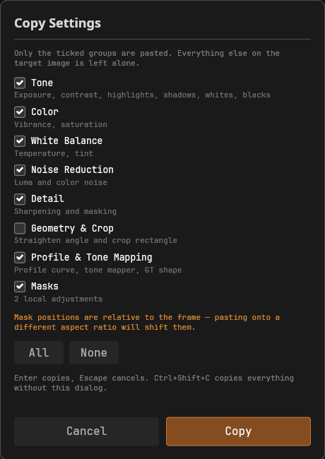
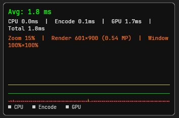

<p align="center">
  
</p>

<p align="center">
  <b>A native RAW photo editor written in Rust.</b><br>
  Non-destructive editing, a GPU colour pipeline, and a catalogue that stays out of your way.
</p>

<p align="center">
  
  
  
</p>

---

RAW Editor develops camera RAW files end to end: import a folder, cull it down,
develop what survives, export. Everything is non-destructive — your RAW files
are never written to, and every adjustment lives in a local SQLite catalogue.

It is a single native binary. No web runtime, no Electron, no background
services, no account.

---

## The home screen

The Library is the catalogue: import folders, browse the grid, filter and
select. Thumbnails stream in as they are generated, so a large import is
browsable immediately rather than after it finishes. The grid size is
adjustable, and the folder filter and star-rating filter narrow what you see.



Images can be rated (0–5), flagged (pick / reject) or marked for removal.
Marking for removal hides an image from Develop while leaving it — and the file
on disk — completely untouched, so you can commit to deleting later. Deleting
from disk moves files to the system trash rather than unlinking them.

---

## Culling

A full-screen single-image view built for going through a shoot quickly.
Arrow keys move through the set, ratings and flags are single keypresses, and
optional auto-advance moves to the next frame as soon as you rate the current
one.



The filmstrip scrolls with weighted momentum — flick it and it glides, scroll
against the motion and it stops immediately.

---

## Develop

The editing module. Adjustments are applied by a WGSL pipeline that reads the
raw Bayer mosaic and produces the displayed image, so what you see is the real
render rather than a proxy.



**Colour.** Real white balance solved through the camera's own colour matrix:
the Temperature and Tint sliders pivot around the as-shot values, in Kelvin and
standard tint units, and an eyedropper sets them from any neutral in the frame.
Where a camera profile (`.dcp`) is installed for your camera, the full profile
pipeline is used — dual-illuminant interpolation, the hue/saturation map as a
3D LUT, and the profile's own tone curve — rather than a naive 3×3 matrix.

**Tone.** Exposure, contrast, highlights, shadows, whites and blacks. Highlight
recovery works in scene-linear space before the tone curve's shoulder, so
pulling back a blown sky restores gradation instead of turning it flat grey.

**Selectable tone mapping.** The profile's tone curve is one option among
several: Camera (the calibrated default), Filmic, Reinhard, Hable, ACES and
GT (the Gran Turismo curve, with its toe, midsection and shoulder exposed as
sliders). Switching operators costs no per-pixel work — each is baked into a
lookup table on the CPU.



**Local adjustments.** Up to eight linear or radial masks per image, evaluated
analytically on the GPU. Radial masks rotate for faces and other off-axis
subjects. Each carries its own exposure, contrast, saturation, warmth, tint,
highlights and shadows.



**Crop and geometry.** Non-destructive crop with a straighten slider. Crop mode
reveals the full sensor area with the discarded region dimmed, so you can
recompose against everything the camera captured.

**Detail.** Luminance and colour noise reduction, and edge-masked unsharp
sharpening.

**History and copying.** Full undo/redo per image. Settings can be copied
between images by category — tone, colour, white balance, noise, detail,
geometry, profile, and local masks — so you can push a white balance across a
shoot without disturbing anything else.




---

## Export

Select images anywhere — <kbd>Ctrl</kbd>+<kbd>A</kbd> for everything visible,
<kbd>Shift</kbd>+click for a range — then open the Export tab to see exactly
what will be written, where, and how it is going.


JPEG, PNG, or 16-bit TIFF, with an optional long-edge limit that only ever
shrinks. Images are rendered one at a time at full sensor resolution, so memory
use stays flat whether the batch is five images or five hundred. Each image
uses its own saved edits, a failure never stalls the rest of the queue, and
existing files are never overwritten — a numbered suffix is added instead.

---

## Performance is the point

Most of the architecture exists to keep the interface responsive while the work
underneath is genuinely heavy. The specifics, rather than the adjectives:

**Nothing decodes on the UI thread.** RAW decoding, JPEG generation, EXIF
parsing and disk reads all run on a blocking thread pool. The update loop
returns immediately and results arrive as messages.

**The render follows the viewport, not the image.** When you zoom in, only the
visible slice of the image is rendered, at the resolution it will actually be
displayed. Rendering the whole frame at zoom-scaled resolution would grow the
cost quadratically — at 100% on a 24MP file that meant rendering, reading back
and re-uploading roughly 24 million pixels to show about two million. Panning
re-projects the existing texture and does not re-render at all until you leave
a pre-rendered margin.

**Debayering happens once.** The pipeline is split in two: a debayer pass that
runs only when the sensor data changes, and a colour pass that reruns as you
drag a slider. Moving Exposure does not re-debayer 24 megapixels.

**One matrix multiply per pixel.** The camera→XYZ→ProPhoto conversion is
composed on the CPU once per frame into a single matrix, so the shader never
traverses XYZ per pixel.

**Three cache tiers plus a RAM budget.** Thumbnails (256px), instant previews
(384px) and working previews (1280px) are generated in the background and
cached on disk; decoded previews and RAW buffers are held in memory under a
budget you control, evicted least-recently-used.

**The catalogue stays off the drag path.** SQLite runs in WAL mode, and edits
are marked dirty during a gesture and flushed once when it ends — not written
on every mouse-move.

**A profiler you can check yourself.** Press <kbd>F3</kbd> for a live frame
graph: CPU, encode and GPU time per frame, the current magnification, the
render target size, and what fraction of the image the window covers.



---

## Where things live on disk

Both locations follow the XDG base directory spec and honour
`XDG_CACHE_HOME` / `XDG_DATA_HOME`.

**`~/.cache/raw-editor/`** — regenerable preview cache. Safe to delete at any
time; it will be rebuilt on demand.

| Path | Contents |
|---|---|
| `thumb/` | 256px thumbnails for the library grid |
| `instant/` | 384px previews for fast full-screen scrolling |
| `working/` | 1280px previews used by Develop and the histogram |

**`~/.local/share/raw-editor/`** — everything you would not want to lose.

| Path | Contents |
|---|---|
| `raw_editor.db` | The catalogue: images, ratings, flags, and all edits |
| `settings.json` | Preferences (cache sizes, preload windows, UI options) |
| `profiles/` | Camera colour profiles — drop `.dcp` files here |
| `logs/` | Daily rolling logs |

Your RAW files are never modified and are never moved into these directories.

### Installing a colour profile

Place a `.dcp` file in `~/.local/share/raw-editor/profiles/`. It is matched
against the camera model from the file's EXIF and picked up on the next image
load. Without one, a matrix-based fallback is used.

Profiles are not interchangeable and not uniform. Some carry a forward matrix,
some only a colour matrix; some embed a tone curve, some deliberately do not;
some are dual-illuminant, some single. The parser handles each of these, but
two profiles for the same camera can still render noticeably differently — that
is the profile's intent, not a bug. No profiles are bundled with the app; bring
your own, and check the licence of any you did not create.

---

## Building

Requires a recent Rust toolchain and a GPU with Vulkan, Metal or DirectX 12.

```bash
git clone https://github.com/HappySlappyFace/RawEditor
cd RawEditor
cargo run --release
```

Release mode is not optional in practice — debug builds are far too slow for
GPU and RAW work.

```bash
cargo build --release   # standard build
cargo run-fast          # release build with the SIMD JPEG decoder
cargo test              # unit tests
cargo clippy            # lints
```

---

## Keyboard

**Navigation**

| Key | Action |
|---|---|
| <kbd>←</kbd> / <kbd>→</kbd> | Previous / next image |
| <kbd>Space</kbd> _(hold)_ | Compare with the unedited original |
| <kbd>Double click</kbd> | Reset zoom and pan |
| <kbd>F3</kbd> | Performance HUD |
| <kbd>I</kbd> | Cycle the info overlay |
| <kbd>Esc</kbd> | Close dialog, or cancel the active tool |

**Rating and culling**

| Key | Action |
|---|---|
| <kbd>0</kbd>–<kbd>5</kbd> | Star rating |
| <kbd>P</kbd> / <kbd>X</kbd> / <kbd>U</kbd> | Pick / reject / unflag |
| <kbd>Delete</kbd> | Delete dialog (or unmark, if already marked) |
| <kbd>D</kbd> | Mark for removal — in the delete dialog |
| <kbd>Enter</kbd> | Confirm the open dialog |

**Editing**

| Key | Action |
|---|---|
| <kbd>C</kbd> | Crop mode |
| <kbd>W</kbd> | White balance eyedropper |
| <kbd>R</kbd> | Reset all edits |
| <kbd>Ctrl</kbd>+<kbd>Z</kbd> / <kbd>Ctrl</kbd>+<kbd>Shift</kbd>+<kbd>Z</kbd> | Undo / redo |
| <kbd>Ctrl</kbd>+<kbd>C</kbd> | Copy settings — choose which |
| <kbd>Ctrl</kbd>+<kbd>Shift</kbd>+<kbd>C</kbd> | Copy all settings |
| <kbd>Ctrl</kbd>+<kbd>V</kbd> | Paste settings |

---

## Status

Working and in use, but young. Known gaps:

- Noise reduction and sharpening do not yet match Lightroom's quality.
- Keyboard shortcuts are not user-configurable.
- Camera profiles are read for their colour matrices, hue/saturation map and
  tone curve, but the optional look table is not applied. Profiles that put
  most of their character in that table — typically the "Landscape", "Portrait"
  and similar creative variants — will render flatter here than in software
  that does apply it.
- The catalogue has no migration tooling; a schema change means rebuilding it.
- Colour calibration has been verified in depth against Nikon NEF files.
  Decoding covers the formats [rawler](https://github.com/dnglab/dnglab)
  supports, but other makes have had less scrutiny.

---

## Built with

[iced](https://github.com/iced-rs/iced) for the interface,
[wgpu](https://github.com/gfx-rs/wgpu) for the rendering pipeline,
[rawler](https://github.com/dnglab/dnglab) for RAW decoding,
[tokio](https://tokio.rs) for async work, and
[rusqlite](https://github.com/rusqlite/rusqlite) for the catalogue.

---

## License

MIT. Created by Ayman Rebai — contributions and forks welcome.
